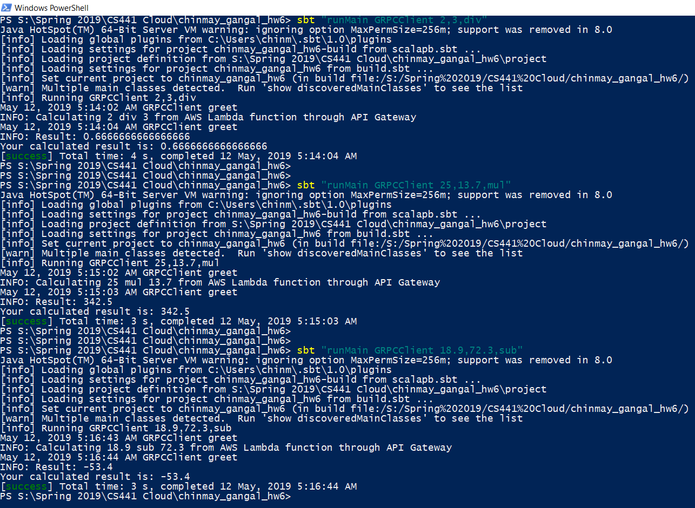

#CS441: Homework 6
##Using gRPC & REST requests to invoke AWS Lambda function through AWS API Gateway

##Steps to run

1. Open command line at root of project (i.e. at /chinmay_gangal_hw6)
2. Run `sbt`. This launches the sbt command line
3. Run `clean`. This erases previous cached output files
4. Run `compile`. This would generate the scala files required from proto using **protobuf**
5. First we need to start gRPC server, by executing command `runMain GRPCServer`.
6. Open another terminal, since the previous would be occupied by the listening server
7. Redo step 2

	
	Before we move on to running the gRPC client, we need to understand the format of input parameters for the calculator.
	
	We have 3 parameters: 2 operands and an operator
	
	Each operand is a valid number (integer & float)
	For operator, we have 3 choice: `add`, `sub`, `mul` & `div` which stand for addition, subtraction, multiplication & division respectively
	
	The input is provided in the following format: `operand1,operand2,operator`
	
	For example, to calculate 5/3, we input `5,3,div`

	Observe that the order of the operands is important for subtraction and division

8. Now we execute client, with command line parameters. Type `runMain GRPCClient <input-as-shown-above>` command.
9. The output will contain a line `Result: <calculation-output>`. 

This is the result of your input returned from AWS Lambda function, accessed through AWS API Gateway

##Technologies used
- Scala
- SBT
- gRPC
- ScalaPB: ProtoBuf for Scala

##Author
Chinmay Gangal: cganga2@uic.edu